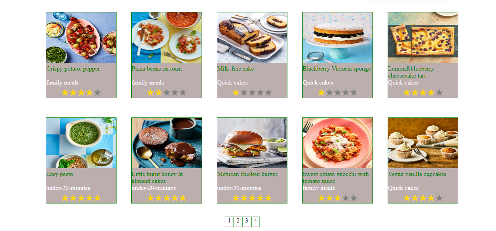

<p align="center">
  <a href="" rel="noopener">
 </a>
</p>

<h3 align="center">Good Food</h3>

---

<p align="center"> Whether you're after an old favourite or inspiration for something new, we have the perfect recipe. Most popular recipe collections. 
    <br> 
<a href=''>Demo</a>
    <br> 
</p>

## 📝 Table of Contents

- [About](#about)
- [Getting Started](#getting_started)
- [Usage](#usage)
- [Built Using](#built_using)
- [User Story](#user_story)
- [Data Flow](#data_flow)
- [Guided By](#guided_by)

## 🧐 About <a name = "about"></a>

The project is a site for displaying food recipes and there is more than one menu according to the user's desire for the type of food. The site consists of more than one food menu and each menu contains its own food, and inside this food you can see the recipe, ingredients, specific food preparation time, specific cooking time and another feature for each user his own privacy. His page is private and he can keep the foods he needs to see later


## 🏁 Getting Started <a name = "getting_started"></a>

These instructions will get you a copy of the project up and running on your local machine for development and testing purposes.

### Prerequisites

- Visual Studio Code follow this <a href='https://code.visualstudio.com/download'>link</a> to install.
- Git Bash follow this <a href='https://git-scm.com/downloads'>link</a> to install.
- MongoDB follow this <a href='https://www.mongodb.com/try/download/community2'>link</a> to install.
- Node.js follow this <a href='https://nodejs.org/en/download/'>link</a> to install.
- Postman follow this <a href='https://www.postman.com/downloads/'>link</a> to install.

### Installing:

1. Clone the repo to your local machine using git bash.

```
git clone https://github.com/your_username_/Project-Name.git
```

2. Install packeges repeat this step in backend and frontend folder

```
npm install
```

3. Run server using git bash inside backend folder

```
npm run dev
```

4. Run application using git bash inside frontend folder

```
npm run start
```

Now app ready to use

## 🎈 Usage <a name="usage"></a>


Ex.
- You have to **register** and **Login** to Good Food


- You can click on the **Home** tab provided in the navigation bar to view the home section



- You can click on the **The Title of List**  To show special products for this list


- You can click on the **The Title of Product**  To show the details for this product


- You can click on the button in detalis **Add Fovrite**  To save in list favorite


## ⛏️ Built Using <a name = "built_using"></a>

- [MongoDB](https://www.mongodb.com/) - Database
- [Express JS](https://expressjs.com/) - Server Framework
- [React JS](https://https://reactjs.org/) - Web Framework
- [Node JS](https://nodejs.org/en/) - Server Environment

## User Story <a name = "#user_story"></a>

Your trello board link
<a href='https://trello.com/b/jDBDY8RY/project4'>Trello</a>

## Data Flow <a name = "#data_flow"></a>

</a>

## ⚠️ Guided By <a name = "guided_by"></a>

This project is guided by ©️ **[MERAKI Academy](https://www.meraki-academy.org)**
